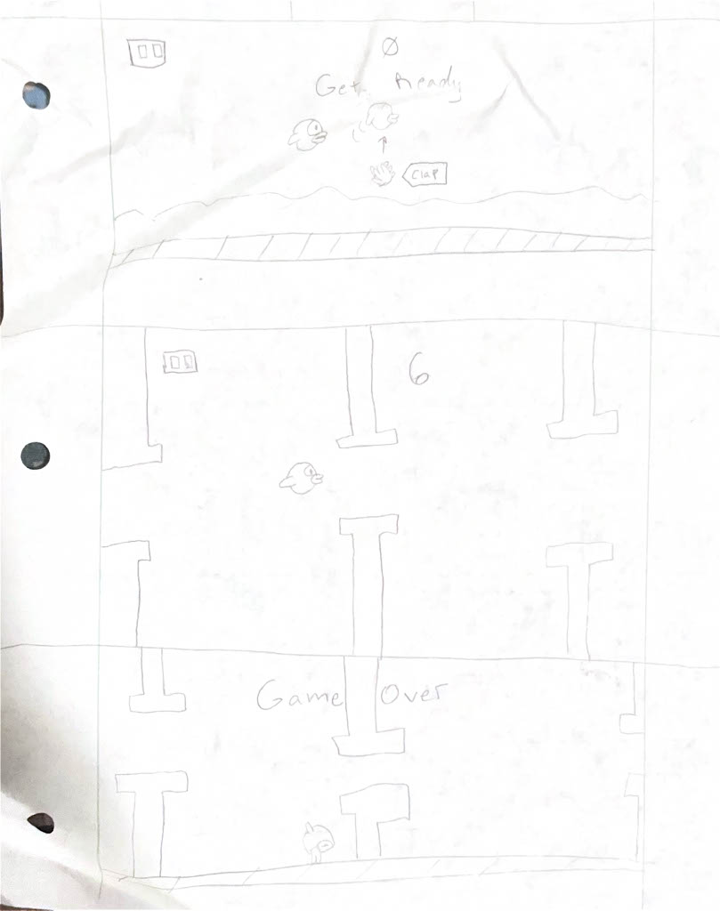

# Clappy Bird

Clappy Bird is an innovative twist on the classic Flappy Bird game that uses sound-activated controls instead of tapping. Players clap their hands (or make any loud sound) to make the bird flap and navigate through pipes. The game features real-time sound detection, physics-based gameplay, collision detection, and a persistent leaderboard system that tracks the top 10 high scores with player usernames.

## Design



## Android and Jetpack Compose Features

### Core Android Components
- **Room Database** - Persistent local storage for high scores and leaderboard data
- **ViewModel & AndroidViewModel** - Manages game state and UI state across configuration changes
- **Coroutines & Flow** - Handles asynchronous operations for game loop and database queries
- **StateFlow** - Reactive state management for UI updates
- **Navigation Component** - Type-safe navigation between screens using Jetpack Navigation Compose
- **Permissions** - Runtime permission handling for microphone access (RECORD_AUDIO)

### Jetpack Compose UI
- **Composable Functions** - Modern declarative UI for all screens (Start, Game, Death)
- **State Management** - `remember`, `rememberSaveable`, and `collectAsState` for state persistence
- **Modifiers** - Extensive use of offset, rotation, size, and border for game elements
- **LazyColumn** - Efficient scrolling leaderboard display
- **DisposableEffect** - Proper cleanup of sound detector when leaving game screen
- **Custom Composables** - Reusable components (Background, Pipe) for modular UI design

### Audio & Sensors
- **AudioRecord API** - Real-time microphone input processing for clap detection
- **Custom Sound Detector** - Amplitude-based sound detection with configurable sensitivity threshold
- **Coroutine-based Audio Processing** - Continuous audio monitoring on background thread

### Game Features
- **Physics Simulation** - Gravity and velocity-based bird movement with configurable constants
- **Collision Detection** - Precise boundary checking for bird-pipe and bird-screen collisions
- **Game Loop** - 60 FPS update cycle using coroutines with 16ms delay
- **Dynamic Difficulty** - Randomized pipe gap positions for varied gameplay
- **Score System** - Real-time scoring with persistent top 10 leaderboard

### 3rd Party & Advanced Features
- **Kotlinx Serialization** - Type-safe route parameters for navigation
- **Room Database Migration** - Fallback to destructive migration for schema changes
- **Image Assets** - Custom graphics with transparent backgrounds and content scaling
- **Material Design 3** - Modern UI components (Buttons, Cards, TextFields, Dialogs)

## Dependencies & Requirements

### Minimum Requirements
- **Android SDK**: Minimum SDK 24 (Android 7.0)
- **Target SDK**: SDK 36 (Android 16)
- **Compile SDK**: SDK 36
- **Kotlin Version**: 1.9.0
- **Java Version**: 11
- **KSP Version**: 2.0.21-1.0.27

### Device Features
- **Microphone**: Required for clap-to-flap controls (RECORD_AUDIO permission)
- **Audio Input**: Device must have working microphone with adequate sensitivity
- **Display**: Designed for portrait orientation

### Key Dependencies
```gradle
// Navigation
implementation("androidx.navigation:navigation-compose:2.7.7")

// Room Database
implementation("androidx.room:room-runtime:2.6.1")
implementation("androidx.room:room-ktx:2.6.1")
ksp("androidx.room:room-compiler:2.6.1")

// Serialization
implementation("org.jetbrains.kotlinx:kotlinx-serialization-json:1.6.3")

// KSP Plugin
id("com.google.devtools.ksp") version "2.0.21-1.0.27"
```

